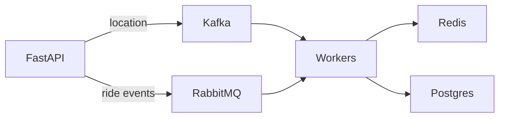
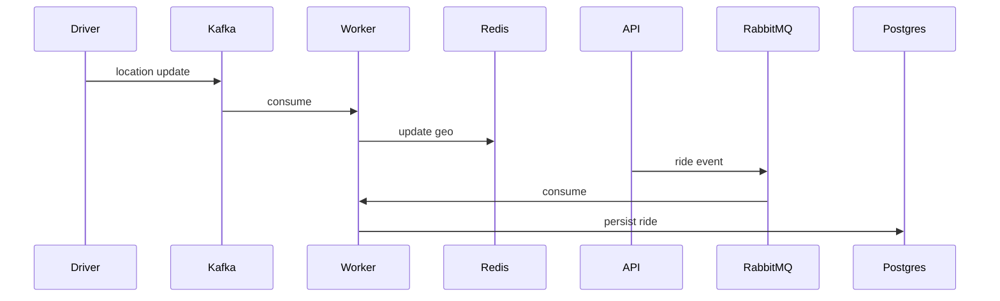

# Cab Assignment Simulator High Level Design

This document outlines a scalable architecture for assigning cabs to ride requests.
It complements the low level design and explains services that extend the simple
in-memory prototype.

## Overview and Goals
The goal is to dispatch nearby available drivers quickly while enabling future
expansion. A full system should ingest driver locations and ride events through
message brokers, store data in durable datastores and expose an HTTP API for
 clients. Non-goals include real-time surge pricing algorithms or mobile app
 features.

## Functional Requirements Coverage
The design addresses the core functional requirements of the allocation problem:

- **Geospatial data** – driver GPS pings and pickup/drop-off coordinates are
  handled as `(lat, lng)` tuples. The `HaversineProvider` computes distances and
  `Settings.max_eta_km_for` enforces an adaptive search radius depending on the
  time of day.
- **Vehicle categories** – the simulator models `Mini`, `Sedan`, `EV`, `SUV`,
  `Auto` and `Bike` via the `VehicleCategory` enum. Mini can upgrade to Sedan,
  Sedan to EV, and EV to SUV. Auto and Bike do not upgrade.
- **Driver states** – drivers transition between `AVAILABLE`, `BUSY`, `OFFLINE`
  and `TIMED_OUT`. The `Driver.is_active` helper rejects drivers whose last GPS
  ping is older than 15 minutes.
- **Surge pricing** – each request carries a `surge_multiplier` applied by
  `FareCalculator` to the base fare settings.
- **EV range** – electric vehicles store their remaining range and are filtered
  out if the ride distance exceeds this value.
- **Allocation strategies** – the base `SingleStrategy` selects the closest
  suitable driver. The design allows batch or multicast strategies to be plugged
  in for further optimisation.

## System Components
### API Server
- **FastAPI** exposes endpoints for drivers and ride requests.
- **Pydantic** validates payloads and handles configuration.

### Message Brokers
- **Kafka** delivers continuous driver location updates.
- **RabbitMQ** queues ride lifecycle events for asynchronous processing.

### Worker Services
- Consumers read from Kafka and RabbitMQ and update datastores.
- Workers can be implemented with Celery or custom asyncio consumers.

### Datastores
- **Redis** with Geo indexes stores active driver coordinates.
- **Postgres** persists driver profiles and ride history.

## Data Flow
1. Drivers publish their current location to Kafka.
2. Worker services consume these updates and write them to Redis.
3. When a ride is created via the API, an event is published to RabbitMQ.
4. Background workers record ride details in Postgres and update driver state.

## Scalability & Deployment
Multiple API instances can run behind a load balancer. Kafka, RabbitMQ,
Redis and Postgres should be deployed in replicated clusters to survive node
failures. Workers run in parallel and scale horizontally to match throughput.

## Diagrams

## Prototype Comparison
The simulator currently maintains drivers in memory and processes rides
synchronously. The README assumes driver locations come through Kafka,
are stored in Redis-Geo and that `max_eta_km` varies by region and time of day.
Those features plus asynchronous ride event handling remain unimplemented.
A scalable deployment would use Redis and Postgres backed by Kafka and RabbitMQ
as shown above.
