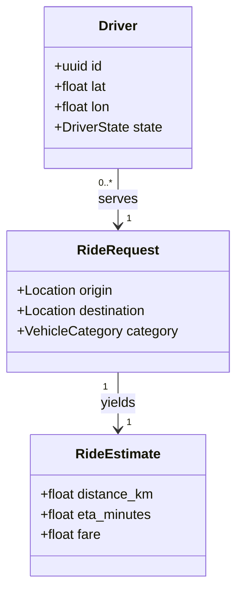
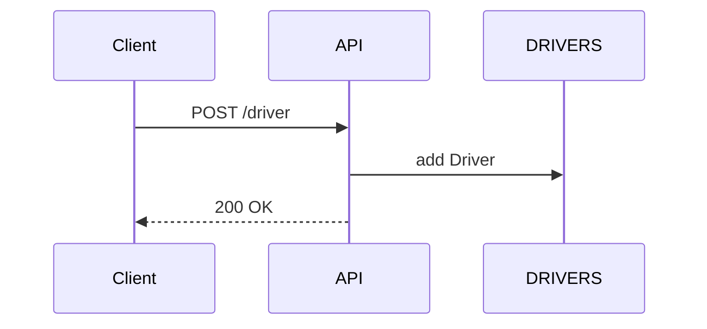
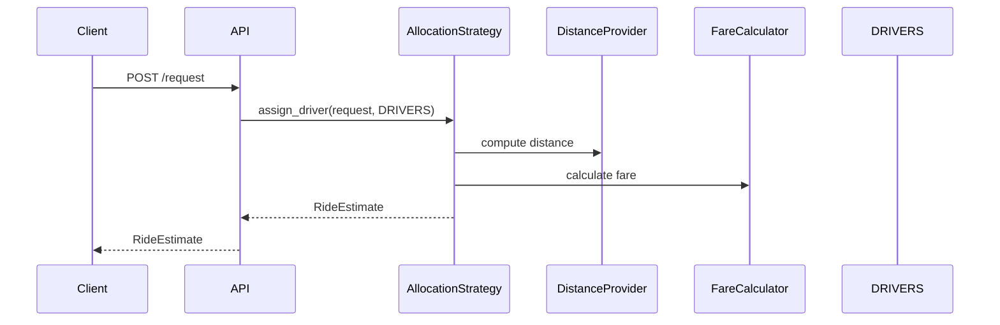

# Cab Assignment Simulator Low Level Design

This document outlines the internal structure of the Cab Assignment Simulator. It describes the major modules, data models and runtime flow used when handling ride requests.

## Overview

The simulator exposes a small FastAPI service that accepts driver registrations and ride requests. Incoming requests are processed by a configurable allocation strategy which selects a suitable driver and calculates the estimated fare.

The project is organised into several packages under `cab_allocator`:

- **api** – FastAPI application entry point.
- **allocation** – algorithms for selecting drivers.
- **geo** – distance calculation utilities.
- **pricing** – fare computation logic.
- **infra** – runtime settings and configuration helpers.
- **models** – dataclasses representing drivers, ride requests and other entities.

Tests for each component live in the `tests` directory.

## Functional Requirements

- **Geospatial** – Ride requests contain pickup and drop-off coordinates. Drivers
  send GPS pings and distances are computed through a pluggable provider
  (`HaversineProvider` by default). `Settings` expose an adaptive `max_eta_km`
  radius that varies by time of day.
- **Categories** – Vehicles operate in the categories Mini, Sedan, EV, SUV, Auto
  and Bike. Requests may upgrade along the hierarchy `Mini → Sedan → EV → SUV`
  but never downgrade. Auto and Bike requests only match the same category.
- **Driver States** – Drivers transition between `AVAILABLE`, `BUSY`, `OFFLINE`
  and `TIMED_OUT` (no GPS ping for 15 minutes).
- **Surge Pricing** – Each `RideRequest` includes a `surge_multiplier` which the
  `FareCalculator` applies when computing the final fare.
- **EV Range** – Electric vehicles specify remaining range and are skipped if a
  ride would exceed it.
- **Allocation** – The strategy interface supports single, batch and multicast
  allocation. The simulator currently implements the simple `SingleStrategy` but
  can be extended for Auto or Bike multicast scenarios.

## Application Flow

1. **Driver Registration** – `/driver` endpoint adds a `Driver` instance to the in-memory list `DRIVERS`.
2. **Ride Request** – `/request` endpoint constructs a `RideRequest` and passes it to the selected allocation strategy.
3. **Driver Selection** – `SingleStrategy` filters and sorts drivers by distance and availability.
4. **Fare Calculation** – `FareCalculator` computes the price using `PricingSettings`.
5. **Response** – the API returns a `RideEstimate` containing ETA, distance and fare.

The `SingleStrategy` is configured with:
- a `DistanceProvider` implementation (`HaversineProvider` by default),
- a `FareCalculator`,
- optional `Settings` to adjust search radius based on time of day.

## Modules

### api/main.py
Defines the FastAPI app. It instantiates the distance provider, fare calculator and allocation strategy. The app maintains an in-memory `DRIVERS` list solely for demonstration purposes.

### allocation/strategy.py
Contains the abstract base class `AllocationStrategy` and the default `SingleStrategy`. The algorithm computes ride distance, filters candidate drivers, and chooses the nearest one whose ETA is below the threshold provided by `Settings`.

### geo/distance.py
Provides a `DistanceProvider` protocol and a `HaversineProvider` implementation. The provider computes the great-circle distance between two coordinates in kilometres.

### pricing
- **settings.py** – holds base fare and per-kilometre rate values.
- **fare.py** – uses the above settings to calculate the final fare applying any surge multiplier.

### infra/settings.py
Uses Pydantic `BaseSettings` to load configuration from environment variables. `max_eta_km_for` returns different search radii for day and night hours.

### models
Defines dataclasses used across the application:
- `Driver` – represents an available driver and exposes `is_active` for status checks.
- `RideRequest` – input payload for a ride request.
- `RideEstimate` – output returned to the caller.
- `VehicleCategory` and `DriverState` enums describing driver capabilities and status.

## Domain Model

The simulator uses a small set of entities. Drivers accept ride requests and the
API returns an estimate for the trip. Their relationships are shown below.

`Driver` instances are stored in-memory for testing. `RideRequest` objects are
short lived and produced for each incoming API call. A single request results in
a `RideEstimate` once the allocation strategy chooses a driver and pricing is
applied.

## Sequence Diagrams

### Driver Registration

### Ride Request Flow

## Extensibility

Additional allocation strategies can inherit from `AllocationStrategy` and be wired into the API. Distance or pricing logic can be swapped by implementing the respective interfaces (`DistanceProvider`, `FareCalculator`).

## Testing

Unit tests cover allocation logic, pricing and the API flow. Execute `pytest --cov=cab_allocator` from the repository root to run the suite.
